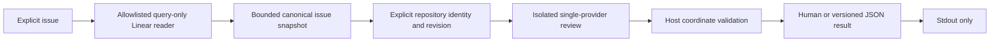
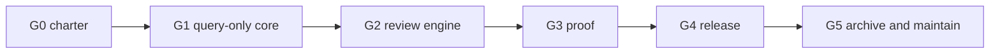

# Standalone Linear Review CLI — Project Plan

Status: reviewed final; destination resolved 2026-08-09 — Linear Project `Linear Review` (team PAR, label Developer Tooling, slugId `564df4804c1e`, explicit no-cycle: team cycles disabled); artifacts committed, apply gated only on the operator-approved live dry-run receipt
Date: 2026-08-09
Working name: `linear-review`
Extraction source: `ostehost/clawsweeper` at `1ada0983efee3f48f97fe0a99d20a402b345db11`
Machine intake: `docs/linear-review-intake.json`

The intake's `currentHead` records the extraction-source revision
(`1ada0983efee3f48f97fe0a99d20a402b345db11`) that the reviewed content derives
from. An artifact cannot name its own carrier commit, so the carrier commit,
Git blob ID, and source-file SHA-256 are recorded in the external import
approval packet and retained verification bundle. Generated `linear-ingest`
receipts and import-index entries bind the source SHA-256 and plan hash; they do
not independently encode the carrier commit.

## Decision

Create a separate, independently installable, exact-item Linear review CLI. Do
not maintain a long-lived ClawSweeper fork for this feature, reopen
https://github.com/openclaw/clawsweeper/pull/1039, or package the current sidecar
wholesale.

Version 1 has one job:

> Given one explicit Linear issue and one explicit local Git repository, fetch
> the issue through a query-only transport, perform one isolated model review,
> mechanically validate cited coordinates, and emit an advisory report without modifying Linear,
> GitHub, or the repository.

`linear-review` is a working name. Avoid `linear-sweeper` unless a later charter
deliberately adds batch scheduling: “sweeper” implies lifecycle automation and
mutation authority that are explicitly outside version 1.

The project should initially live under the contributor's namespace rather than
an OpenClaw package scope. Upstream maintainers closed the integration and have
not sponsored an official OpenClaw product. Naming and ownership are frozen in
LRV-002 before the repository is provisioned.

## Ultracode synthesis

This draft was produced with a bounded ultracode workflow:

1. A local extraction audit measured the current implementation and mapped its
   ClawSweeper dependencies.
2. An architecture lane proposed the smallest independent runtime and proof
   boundary.
3. A planning lane produced a dependency-complete project and issue sequence.
4. An adversarial lane attacked credentials, GraphQL capability, model
   isolation, prompt injection, evidence, packaging, schema drift, filesystem
   handling, and release claims.
5. This document reconciles the lanes and rejects both wholesale extraction and
   a rewrite from zero.

The decisive finding is that a separate repository is not itself a security
boundary. The shipped artifact, approved GraphQL operations, child environment,
model sandbox, evidence validation, and absence of mutation code create the
boundary.

## Product contract

### Primary workflow

```text
linear-review review <TEAM-NUMBER|LINEAR-URL> \
  --repo <absolute-checkout> \
  --repo-id <owner/name> \
  [--json]
```

The final syntax and exit codes belong to LRV-002. The intended flow is:



### Version 1 includes

- Exact issue lookup by `TEAM-NUMBER` or canonical Linear URL.
- A fixed Linear endpoint and a private allowlist of production query documents.
- Parser-enforced exactly-one-query validation before fetch, retry, or sleep.
- Complete source hydration within hard pagination and item bounds. Exceeding a
  source bound fails rather than reviewing partial provider data.
- Explicit trusted repository path and expected `owner/name` identity.
- An exact repository head/tree/dirty-state receipt.
- One supported model runner, initially Codex, under a controlled read-only
  sandbox and allowlisted environment.
- A small standalone advisory result schema.
- Host mechanical validation of cited commits, paths, lines, and excerpts.
- Human output and one-value JSON output without runtime persistence.
- Deterministic fixtures, pinned-schema conformance, a packaged-artifact proof,
  and an operator-only dynamic live proof.
- One explicitly versioned and authenticated Codex CLI runtime. The npm package
  is not standalone from that external executable; `doctor` must verify it.

### Version 1 excludes

- Linear issue, comment, label, state, priority, assignment, project, cycle, or
  relationship mutation.
- GraphQL mutation documents in the production package.
- `--apply`, approvals, managed comments, app actors, write credentials, or
  mutation receipts.
- Workspace, team, or project sweeps; stale classifiers; batch triage.
- Cron, daemon, webhook, queue, hosted service, or MCP server operation.
- Repository inference from issue text as authority.
- Clone, fetch, pull, checkout, reset, worktree creation, or repository writes.
- Attachment-body downloads, arbitrary linked-URL fetches, or model web search.
- ClawSweeper records, close policy, repair, automerge, Worker/R2, dashboard, or
  OpenClaw Bay integration.
- A generic tracker SDK, generic model plugin system, cache, telemetry, or cloud
  publication.

OpenClaw Bay is unaffected: the CLI creates no Bay data contract, status feed,
or action.

## Trust and credential boundaries

### Linear authentication

- Credentials are supplied through the environment only. They never appear in
  arguments, config files, receipts, diagnostics, or model input.
- Personal API keys are acceptable for a local operator tool. If the project is
  later distributed as an application for other workspaces, OAuth read scope is
  a separate charter.
- The runtime fixes `https://api.linear.app/graphql`, rejects redirects, and has
  no endpoint override that could receive a credential.
- The GraphQL executor remains private. Callers cannot submit arbitrary query
  text.
- Approved production operations are hash-allowlisted and schema-validated.

### Model isolation

- Before scaffolding, LRV-001 must prove a specific Codex CLI version can supply
  provider authentication while keeping credentials out of generated-command
  environments on every initially supported platform. It must also enumerate
  which issue fields, repository content, and tool output leave the machine,
  document provider retention/training/telemetry terms, and define explicit
  first-run operator consent. Failure stops the project before extraction.
- Only the host Linear reader receives the Linear token.
- The model runner receives the minimum provider authentication it requires but
  no Linear, GitHub-write, registry, cloud, SSH-agent, or unrelated host
  credential.
- Model-generated commands run with the repository mounted/readable but not
  writable, no network, an empty or controlled home, bounded output, and a hard
  timeout.
- Linear issue content and repository files are both treated as adversarial
  input. Prompt delimiters are defense in depth, not the security boundary.
- No user model configuration, MCP server, web search, or arbitrary provider
  executable is inherited in version 1.
- A secret-free `doctor` command verifies the exact supported Codex version,
  authentication availability, sandbox capabilities, and repository isolation
  before a live review.

### Output

- Runtime operation writes the completed result to stdout and persists nothing.
- `--json` writes exactly one schema-versioned JSON value to stdout; diagnostics
  use stderr.
- Development proof and recovery artifacts are atomic and owner-only or
  platform-equivalent, reject symlinks and non-regular destinations, and never
  land in the reviewed repository.
- A development-only public proof receipt uses an allowlist and a caller-provided alias. It omits
  issue identifiers, team keys, content, local paths, raw model output, tokens,
  endpoints, and private model identifiers.
- A receipt digest is a checksum, not a signature.

## Extraction boundary

The current sidecar is roughly 18,000 lines including its Linear-focused tests
and still contains mutation documents, lifecycle vocabulary, repository
profiles, and ClawSweeper model-runner imports. Port behavior and selected tests,
not directories.

### Keep or narrowly adapt

| Source                       | Retained behavior                                                                  |
| ---------------------------- | ---------------------------------------------------------------------------------- |
| `src/linear/client.ts`       | GraphQL AST query-only gate, secret-free errors, GraphQL/HTTP handling             |
| `src/linear/retry.ts`        | Bounded retry classification and delay rules                                       |
| `src/linear/queries.ts`      | Only the exact-item read query and required pagination queries                     |
| `src/linear/source.ts`       | Identifier parsing, strict response parsing, cursor-cycle and drift detection      |
| `scripts/linear-analyze.mjs` | Bounded untrusted serialization, credential scrubbing, checkout checks             |
| `src/linear/analyzer.ts`     | Evidence-verification concepts only                                                |
| Focused tests                | Transport rejection matrix, retries, exact-item mapping, schema and proof fixtures |

### Rewrite

- The issue snapshot so its one canonical digest covers every model input,
  including selected comments, attachment metadata, creator, labels, and
  truncation state.
- The advisory result schema and prompt without ClawSweeper close/apply terms.
- Repository inspection around explicit trusted input rather than profiles or
  inference.
- Model orchestration as small TypeScript modules instead of a large `.mjs`
  command importing ClawSweeper.
- Public proof receipt and private recovery formats outside the runtime package.
- The dynamic live fixture harness as development-only code outside the packed
  production artifact.

### Do not extract

- `authority.ts`, `comment.ts`, `policy.ts`, `trigger.ts`, workspace `scope.ts`,
  and deterministic `classifier.ts`.
- Comment/review apply commands, label planning, marker ownership, app actors,
  scheduler seams, and retained mutation constants.
- `repository-profiles.ts`, `config/target-repositories.json`, ClawSweeper's
  decision schema, `agent-runner.ts`, `parseDecision`, Worker/R2, repair, or Bay.
- macOS-specific Keychain coordinates or hidden checkout conventions.
- The current cache identity derived from the Linear credential.

Substantial ported code must retain the ClawSweeper MIT notice and identify the
source commit and original path. The pinned Linear schema source and license are
recorded separately.

## Target architecture

```text
src/
  cli.ts
  commands/review.ts
  linear/auth.ts
  linear/client.ts
  linear/queries.ts
  linear/issue-reader.ts
  linear/types.ts
  repo/identity.ts
  repo/context.ts
  review/contract.ts
  review/prompt.ts
  review/codex-runner.ts
  review/evidence.ts
  output/human.ts
  output/json.ts
schema/
  review-result.schema.json
scripts/
  schema-conformance.mjs
  proof-readonly.mjs
  e2e/linear-live.mjs
  e2e/private-artifact.mjs
  e2e/public-receipt.mjs
schema-proof/
  public-receipt.schema.json
test/
  fixtures/
  unit/
  integration/
  e2e/
```

Recommended baseline:

- Node 24+, ESM, strict TypeScript, pnpm.
- Built-in `node:util.parseArgs` and `node:test` rather than CLI/test frameworks.
- Exact `graphql` version for the parser security boundary and one small runtime
  schema validator if host validation cannot remain simple and explicit.
- `oxlint` and `oxfmt` for repository gates.
- No runtime dependency on ClawSweeper, no config file, no cache, no install-time
  scripts, and no postinstall hook.

Required scripts:

```text
build
test
lint
format:check
check
schema:conformance
proof:readonly
e2e:linear:live
pack:smoke
```

## Review result contract

LRV-011 freezes the advisory schema. The minimal semantic result should
separate outcome from rationale:

- `disposition`: `actionable | no_action | needs_human | uncertain`;
- `reason`: `not_present | present_at_reviewed_revision | needs_information |
product_direction | repository_mismatch | unclear`;
- confidence and concise summary;
- recommended next step, always advisory;
- evidence entries with claim, commit, path, line, excerpt, and optional command;
- explicit omissions, truncation, and limits;
- source snapshot hash and stable issue UUID;
- repository remote, head, tree, dirty state, and comparison base;
- tool, prompt, output-schema, provider/model public identity, and runtime
  versions;
- host evidence-validation results; and
- `remoteWritesAttempted: false`.

A finding is never declared semantically verified merely because its coordinates
validate. Host checks establish only that the path is inside the repository, the
file and line exist at the recorded revision, the excerpt matches, and the commit
is reachable from the recorded head. Whether that evidence proves the model's
claim remains an advisory model judgment. Model-reported commands and
host-observed commands are recorded separately.

## Validation strategy

### Deterministic layer

- Handwritten transport fixtures for retry, malformed response, partial GraphQL
  error, cancellation, cursor, and drift behavior.
- A forbidden-document matrix proving zero fetch, retry, and sleep calls.
- Golden canonical snapshot, prompt, result, and receipt fixtures.
- A fake model runner and disposable Git repository for integration tests.
- An external development-only Node preload/interceptor for packed-binary Linear
  fixtures. It replaces `fetch` before the installed CLI loads, lives outside
  the tarball, and CI proves no endpoint or arbitrary-provider seam ships.
- A packed-tarball test executed outside both source repositories.
- A negative-capability scan of the source and packed artifact.
- Pinned Linear schema download by immutable commit, byte count, and digest,
  followed by validation of every approved production query.

### Dynamic live proof

The product runtime remains query-only. A separate operator-only development
harness may mutate a caller-owned test workspace solely to create and clean up
the proof fixture:

1. Accept a caller-owned team UUID, a setup credential, and a distinct read
   credential from the environment.
2. Remove both credentials from the build environment.
3. Acquire an exclusive run lease and durably write a pre-create recovery record
   containing workspace/team identity, run ID, timestamp, unique correlation
   UUID/title, and an idempotent recovery command.
4. Create one harmless issue in final form using the setup credential.
5. Run the packed production CLI with only the read credential against an
   explicit disposable repository.
6. Run the actual model review and host evidence validation.
7. If creation succeeds but its response is lost, perform a bounded lookup by
   the unique team/correlation tuple before considering any retry.
8. Trash exactly the recovered or returned issue UUID in `finally` with the
   setup credential through a separately callable idempotent cleanup command.
9. Verify it is absent from the active workspace and remove the recovery record
   and lease only after cleanup read-back succeeds.
10. Emit a public-safe receipt separating fixture-harness mutations from the
    subject under test, whose mutation count must be zero.

Cleanup failure makes the overall proof fail even when the subject review
succeeds. Linear trash is recoverable and retained by Linear for a provider-
defined period; cleanup is not claimed as permanent erasure.

The setup credential, fixture mutation documents, recovery data, and cleanup
code must be absent from the published runtime tarball. The proof is
operator-only and excluded from ordinary CI, but it is mandatory for a release
candidate. Missing credentials block release rather than weakening the gate.

### Release gates

- Current-head focused tests and full `check` pass.
- Production package contains zero GraphQL mutations, generic GraphQL execution,
  apply flags, write scopes, ClawSweeper runtime imports, or unexpected files.
- Prompt-injection tests cover hostile issue fields, comments, repository files,
  ANSI/OSC controls, fake tool instructions, oversized inputs, and delimiters.
- Model commands cannot read credentials, write the repository, or use network.
- Full packed-artifact live proof passes with redacted receipt and verified
  cleanup.
- The exact live-proven tarball bytes are published without rebuild, or the
  downloaded registry tarball receives a fresh live subject proof before the
  release is declared complete.
- Install/help/version/JSON smoke and the approved OS/runtime matrix pass.
- Dependency/license audit, SBOM, provenance, checksum, rollback, and security
  review are complete.
- No unresolved P1/P2 correctness or security finding remains.

## Sequential Linear issue groups

The machine-readable definitions and acceptance criteria are in
`docs/linear-review-intake.json`. Import only after the new Linear project
exists and the operator approves a live dry-run receipt.

### Group 0 — Charter and project bootstrap

Exit gate: product, threat, naming, CLI, provenance, owner, repository, and
Linear project boundaries are approved.

| Key     | Issue                                                       | Depends on       |
| ------- | ----------------------------------------------------------- | ---------------- |
| LRV-001 | Approve product charter, support matrix, and threat model   | —                |
| LRV-002 | Freeze name, CLI, configuration, output, and exit contracts | LRV-001          |
| LRV-003 | Create extraction, provenance, and licensing manifest       | LRV-001          |
| LRV-004 | Verify project provisioning and freeze bootstrap receipts   | LRV-002, LRV-003 |

### Group 1 — Query-only foundation

Exit gate: the independent packed package can fetch and validate one complete
issue through a statically and dynamically enforced query-only boundary.

| Key     | Issue                                                                 | Depends on       |
| ------- | --------------------------------------------------------------------- | ---------------- |
| LRV-005 | Scaffold package, CI, and packed-artifact gates                       | LRV-004          |
| LRV-006 | Define the canonical Linear issue snapshot and source envelope        | LRV-002, LRV-005 |
| LRV-007 | Extract query-only transport, authentication, retry, and cancellation | LRV-005, LRV-006 |
| LRV-008 | Implement exact issue hydration and drift-safe snapshotting           | LRV-006, LRV-007 |
| LRV-009 | Enforce negative mutation capability as a build invariant             | LRV-007, LRV-008 |

### Group 2 — Repository and review engine

Exit gate: a deterministic fixture can be reviewed against one immutable,
explicit repository without credential, network, or write exposure.

| Key     | Issue                                                             | Depends on                |
| ------- | ----------------------------------------------------------------- | ------------------------- |
| LRV-010 | Implement explicit repository identity and revision preflight     | LRV-005, LRV-006          |
| LRV-011 | Define the standalone advisory review protocol and bounded prompt | LRV-008, LRV-010          |
| LRV-012 | Build the isolated Codex runner and credential firewall           | LRV-010, LRV-011          |
| LRV-013 | Validate model output and re-verify all evidence                  | LRV-008, LRV-011, LRV-012 |
| LRV-014 | Implement development-only recovery artifacts and proof receipts  | LRV-006, LRV-013          |
| LRV-015 | Wire the exact-item review command                                | LRV-009, LRV-010, LRV-013 |
| LRV-016 | Complete human/JSON output, diagnostics, and signal UX            | LRV-002, LRV-015          |

### Group 3 — Product proof and documentation

Exit gate: the packed binary has documented interfaces, hermetic end-to-end
coverage, an adversarial security verdict, and a successful dynamic live proof.

| Key     | Issue                                                              | Depends on                         |
| ------- | ------------------------------------------------------------------ | ---------------------------------- |
| LRV-017 | Publish installation, security, schema, and troubleshooting docs   | LRV-016                            |
| LRV-018 | Add hermetic packed-binary end-to-end and extraction-parity tests  | LRV-009, LRV-013, LRV-015, LRV-016 |
| LRV-019 | Complete adversarial security review and negative-capability proof | LRV-012, LRV-015, LRV-018          |
| LRV-020 | Run the dynamic live Linear create/read/review/cleanup proof       | LRV-014, LRV-018, LRV-019          |

### Group 4 — Qualification and release

Exit gate: the compatibility contract is frozen and a provenance-backed v1
package has been published and rollback-tested.

| Key     | Issue                                                | Depends on                         |
| ------- | ---------------------------------------------------- | ---------------------------------- |
| LRV-021 | Qualify platforms, installation, and resource limits | LRV-016, LRV-018, LRV-019          |
| LRV-022 | Run private beta and freeze the v1 contract          | LRV-017, LRV-020, LRV-021          |
| LRV-023 | Publish and verify the provenance-backed v1 package  | LRV-019, LRV-020, LRV-021, LRV-022 |

### Group 5 — Fork disposition and maintenance

Exit gate: the fork is no longer an active second ClawSweeper distribution and
the standalone owner can detect and respond to provider/security drift.

| Key     | Issue                                                              | Depends on       |
| ------- | ------------------------------------------------------------------ | ---------------- |
| LRV-024 | Archive the extraction source and retire the active forked sidecar | LRV-023          |
| LRV-025 | Operate post-release compatibility, security, and maintenance      | LRV-023, LRV-024 |

### Critical path



Within groups, issue dependencies permit safe parallelism. No later group may
claim its exit gate while an earlier release-blocking issue remains open.

## Deferred charters, not version 1 backlog

The intake artifact declares these as optional and excludes them by default:

- LRV-901: explicitly bounded multi-issue input.
- LRV-902: OAuth read authentication for third-party distribution.
- LRV-903: signed webhook trigger and hosted receiver.
- LRV-904: any Linear write capability and settlement RFC.
- LRV-905: additional model-provider adapters.

None should be imported or implemented merely because version 1 succeeds. Each
requires observed operator demand and a fresh product/security charter.

## Project creation and issue-ingest procedure

1. Before issue intake, approve the working name, owner/namespace, visibility,
   license, emoji, purpose, project label, platform matrix, Linear team/project,
   and whether this contributor-owned project receives full PartnerAI fleet
   onboarding. Fleet onboarding does not imply OpenClaw sponsorship.
2. Create the empty repository and Linear project through the applicable
   sanctioned workflow and capture its external receipts. If full fleet
   onboarding is selected, also complete its registries, generated conductor
   workflow, workspace manifest, UI pin, launcher, and ledger gates. Any
   generated keychain account is fleet metadata only and must remain unused by
   the `linear-review` runtime.
3. Import LRV-001–LRV-025 only after that destination exists. LRV-004 verifies
   the already-created bootstrap state; it no longer creates its own container.
4. Commit these reviewed artifacts while keeping `currentHead` pinned to the
   extraction-source revision. Record the carrier commit, Git blob ID, and
   source-file SHA-256 externally, and replace `TODO` with the exact
   team/project and either an explicit cycle or an explicit no-cycle decision.
5. Use `linear-ingest` as the only issue-create path: regenerate `plan`, run
   `preflight`, create any approved dependencies through their separate receipt
   gate, then run a fresh live `dry-run`.
6. Have the governance-authorized operator for this batch authorize the exact
   destination, plan hash, and live dry-run receipt. This import approval is
   separate from the long-term project owner that LRV-001 must name.
7. Run approved-receipt `apply`, then `read-back` and retain the import index.
   Verify every issue identifier, URL, priority, dependency, and project/cycle
   binding.
8. Execute groups in order and keep proof current on the exact head and exact
   packaged bytes.

Plan-stage validation is expected to pass with a `TODO` destination so the
artifact can be reviewed. Destination-required validation, preflight, dry-run,
and apply must fail until steps 1–4 resolve the destination and provenance. The
OpenClaw-specific activation-hold contract is deliberately not reused for this
unrelated batch.

## Definition of done

The project is complete when:

- v1 is installed from a reviewed, provenance-backed package rather than the
  ClawSweeper worktree;
- exact-item reviews work from clean install using only published docs;
- production and packed artifacts expose no Linear mutation capability;
- the actual model-review path has current deterministic, adversarial, packaged,
  live, and cleanup evidence;
- public artifacts contain no secret or private issue/repository data;
- immutable extraction refs are preserved and a separately approved,
  non-destructive fork disposition is completed instead of maintaining a second
  ClawSweeper distribution; and
- a named owner and compatibility/security cadence are documented.
