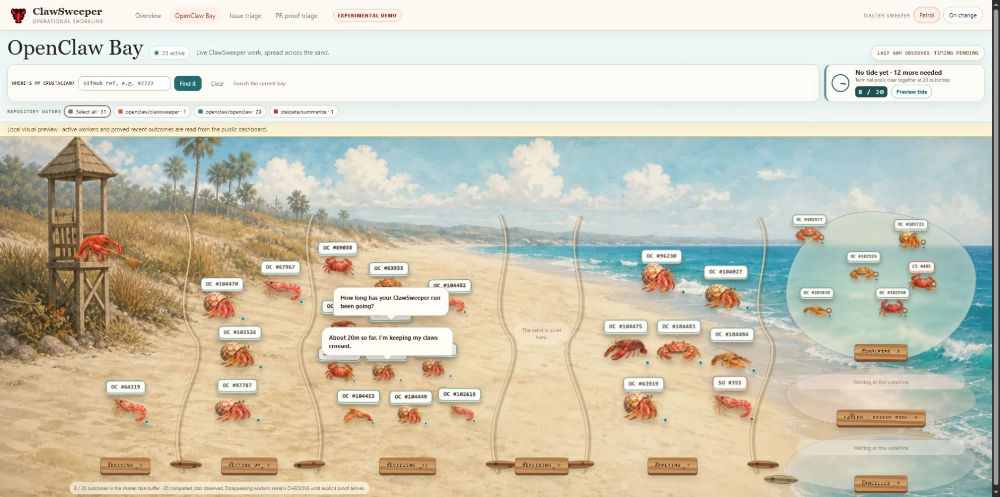

# OpenClaw Bay

- Status: active public observer guide
- Owner: ClawSweeper maintainers
- Source of truth: `dashboard/bay-page.ts`, Worker queue projections, Bay tests,
  and the read-only `/bay` route
- Last verified: `openclaw/clawsweeper@71b16d208511700bb241ea06276c94f71c977d89`
- Update when: lane names, stage mapping, projection bounds, control cards,
  routes, or navigation changes

OpenClaw Bay is a public, indexable, read-only visualisation of the live
ClawSweeper pipeline. It lives at `/bay` on the existing dashboard Worker
and turns active work into animated crustaceans moving across a shoreline. It
is linked from the Overview, issue-triage, and PR-proof headers as a normal
ClawSweeper web-page destination.



[Watch the 32-second browser recording](openclaw-bay-demo.mp4). It shows the
live populated shoreline, master-sweeper movement between lanes, terminal
pools, and the contextual crustacean chat behavior. The recording is a
1280×720 H.264 review artifact with audio and capture metadata removed.

The checked-in `docs/proof/openclaw-bay` package is historical evidence captured
from behavior source `71b16d208511700bb241ea06276c94f71c977d89`; it is not
presented as proof of later documentation-only or rebase commits. Current pull
requests must publish their exact-head proof package and provenance in the PR
body. The historical run used the real page and artwork with a fully synthetic,
redacted status sequence and made no live dashboard reads.

Bay is an observer-only surface: it displays bounded public status but never
triggers or offers queue, workflow, GitHub, DLQ, recovery, deploy, or rollback
actions. Its public visibility is not an authorization boundary; any future
restricted surface would require separate authentication or access-control
design.

## What It Shows

The six active lanes group the current worker and durable queue state into:

- Arriving
- Setting up
- Reviewing
- Publishing
- Repair cove
- Applying & writing

An item that advances raises a ready flag before the master sweeper moves it to
the next reported lane. Any observed new run for the same GitHub item is
represented by a tunnel, even when polling first sees that run in the same or a
later lane. Completed, failed, and cancelled pools contain only explicit
terminal evidence; a disappearing worker is never treated as successful.
Because the completed-job evidence cache can trail the active feed, a worker
that disappears remains in its last lane as **CHECKING** for up to 150 seconds.
It is swept into a terminal pool only when explicit outcome evidence arrives.

The terminal buffer is deliberately small. At 20 proved outcomes, the tide
animation clears the visible pools. The Durable Object record retains fewer
than 20 buffered outcomes, the most recent 20 washed outcomes, and at most 256
seen event identifiers under the existing seven-day event TTL. Stored content
is rewritten only when that bounded state changes. If an item is retriggered,
its prior terminal record no longer counts toward the visible tide while its
event identifier remains deduplicated. The Preview tide button changes only the
browser animation and does not mutate stored state.

Repository filters and **Where's my crustacean?** operate entirely on the
current snapshot. Selecting a crustacean opens the same GitHub and workflow-run
links exposed by the source worker data.

The exact-review control board above the shoreline separates review admission
from result publication. It shows current lane totals, bounded 6-hour, 24-hour,
or 7-day history, and the durable handoff between them. A separate state-writer
card reports the coordinator that serializes remaining Git-backed operational
writes. These cards are observational: they expose no queue, recovery, deploy,
or rollback controls.

Lane totals may exceed the individually rendered crustaceans. The public queue
projection intentionally bounds its item-reference sample; the overflow drawer
shows known references and explains when additional counted items fall outside
that sample. It never invents identities or performs a browser-side GitHub
lookup to fill the gap.

## Data And GitHub API Load

Bay is a presentation over the existing cache-backed `/api/status` snapshot.
It adds no browser-to-GitHub requests and no new GitHub REST or GraphQL query
path. Active work, explicit terminal outcomes, and observed completion timing
are derived from workflow-job and recent-close data already collected for the
Overview page.

Bay polls the Worker every 20 seconds, compared with Overview every 15 seconds:
three rather than four browser status requests per minute after initial load.
That is 25% fewer requests to the Worker, not a claim of 25% fewer GitHub API
calls. The existing 20-second server cache, snapshot age, edge location, and
other viewers determine when either page causes a GitHub refresh. In
particular, Bay's 20-second timer can align with cache expiry, so Bay does not
claim a lower upstream GitHub refresh rate than Overview.

The displayed end-to-end timing is an observed sample of the latest completed
jobs found in the previous hour, not a complete one-hour census. Per-lane wait
times are not shown because the current data cannot support them accurately.

## Assets And Deployment

The page, status API, and image assets all belong to `openclaw/clawsweeper`:

- `dashboard/bay-page.ts` renders the page.
- `dashboard/worker.ts` serves `/bay`, permanently redirects legacy `/bay-demo`
  bookmarks, and derives the bounded Bay state.
- `dashboard/public/bay-assets/` contains the three WebP assets.
- `dashboard/wrangler.toml` binds that public asset directory.
- `.github/workflows/dashboard.yml` deploys the existing
  `clawsweeper-status` Worker to `clawsweeper.openclaw.ai`.

The Bay HTML is `no-store`, frame-blocked, and protected by a content security
policy. `/bay` is the single canonical public route; `/bay-demo` is retained
only as a query-preserving permanent redirect for compatibility with existing
links.

## Local Proof

Start the Worker:

```bash
pnpm run dashboard:dev
```

Then open <http://127.0.0.1:8787/bay>. When local GitHub telemetry is
unavailable, the localhost page may read the existing public, cache-backed
production status snapshot for visual proof. The hosted page remains
same-origin in its request behavior; the CSP allows only self and OpenClaw
HTTPS subdomains so Wrangler's localhost preview can reach that production
snapshot.

The deployment smoke test also checks the Bay route, security headers,
legacy `/bay-demo` redirect, other unpublished route variants, and all three WebP assets:

```bash
pnpm run dashboard:smoke -- http://127.0.0.1:8787
```
